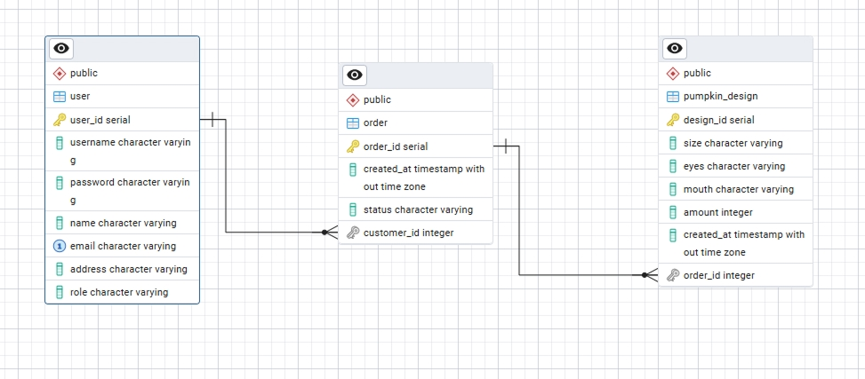
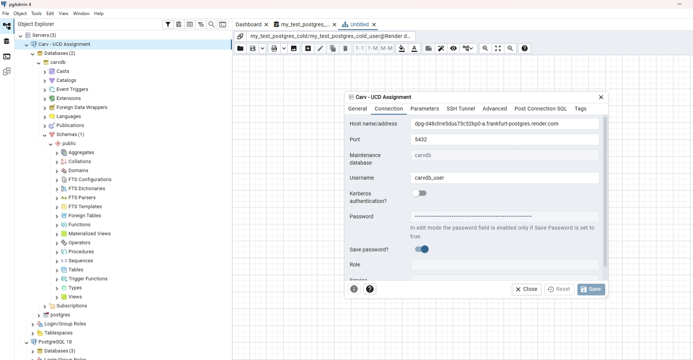

# My design decisions
## User stories

### Roles:
- Customer who wants to buy bespoke carved pumpkins for Halloween
- The business owner who, as an admin, wants to get and process orders

<br>

### Customer user stories:

#### 1. Order the product
[MUST] As a customer, I want to buy a carved pumpkin, so I can put it on display for Halloween.

#### 2. Customise pumpkin appearance
[MUST] As a customer, I want to customise the appearance of my pumpkin, so that my pumpkin is unique to me.

#### 3. Add different products to my order
[MUST] As a customer, I want to buy multiple different pumpkins at the same time, so that I can display different ones.

#### 4. Check before confirming order
[MUST] As a customer, I want to see a final 'Confirm your order' page, so I can double check that my order is correct.

#### 5. Login to my account
[MUST] As a customer, I want to log in to my account, so I can see details of my current & past orders.

#### 6. Cancel an order
[MUST] As a customer, I want to cancel an order, so I can back out of purchasing the product.

<br>

### Business owner user stories:

#### 1. Take orders
[MUST] As the business owner, I want to take orders from customers, so I can sell my products for Halloween.

#### 2. Login as admin
[MUST] As the business owner, I want to log in to my 'admin' account, so I can see what orders customers have placed.

#### 3. Edit order status 
[MUST] As the business owner, I want to change the status of orders, so I can mark them as 'In progress', 'Delivered', etc.

<br>

### Future stories:

#### 1. Choose delivery date
[SHOULD] As a customer, I want to select a date for my pumpkin to be delivered, so I can recevie it in time for Halloween.

#### 2. Limit daily deliveries
[SHOULD] As the business owner, I want to only allow a certain amount of pumpkin deliveries per day, so I am not overwhelmed with work.

<br>
<br>


## Content
The site will include:
- Homepage with introduction and different actions depending on user role
- 'Signup' page to allow users to register to Carv
- 'Login' page to allow users to start sessions

Customer-only pages:
- 'Create' page with a form for designing a pumpkin
- 'Order' page with order details and the ability to change, cancel or confirm the order
- 'Add' page allowing users to add another pumpkin to their order
- 'My account' page showing the user's orders, with 'cancel' action on orders that are yet to be delivered 
- 'Thank you' page to show order completion

Admin-only pages:
- 'Admin' page showing all orders in the system as well as stats on sales

<br>
<br>

## Prioritised tasks:
1. Design database tables in pgAdmin
2. Write classes and functions in Python to facilitate the user stories
3. Use Flask to set up templates, routes, etc
4. Use a combination of CSS and Bootstrap for the style and layout of the site
5. Use SQLAlchemy and SQLite/Postgres for CRUD actions on tables (creating, reading, updating and deleting data)
6. Use Jinja and Javascript for the functionality of the site
7. Set up Postgres on Render.com and deploy app


<br>
<br>

## Wireframes

I created basic wireframes in Figma for mobile and desktop, with the mobile layout responsively catering for tablets too.

<br>
<br>

## Databases and tables

### ERD

I made an ERD of the tables I needed in pgAdmin. I mapped out the columns I wanted to use, what the relationships were and which were the Primary and Foreign Keys:



### pgAdmin

I successfully set up the connection between Render and pgAdmin:


<br>
<br>

### Sample queries

I tested out database queries in pgAdmin to make sure I could get the information I needed. I later used ORM to make the same queries, but these are the original SQL queries.

Example 1: I used the following query to read all orders from a particular customer, ordered numerically by `order_id`:
```
SELECT * FROM "order"
WHERE customer_id = 4
ORDER BY order_id;
```

Example 2: I updated the status of one of the 'Complete' orders to 'Delivered'.

```
UPDATE "order"
SET status = 'Delivered'
WHERE order_id = 2;
```

Example 3: When deleting a row in the `order` table, it cascade deletes the related pumpkins via the Foreign Key relationship.

```
DELETE FROM "order"
WHERE order_id = :order_id;
```
<br>
<br>

### Raw SQL

I included some raw SQL on the /admin page, for the 'Statistics' card. To avoid cluttering up the app.py file, I split the raw queries off into their own queries.py file, which I then import into app.py.

<br>
<br>

# My development process
## How I went about it

The following is a step-by-step account of how I did the project, which closely corresponds with the series of commits I made to the repo.

- Brainstormed initial ideas for the assignment
- Wrote user stories and entities
- Fleshed out entities and attributes, and determined what primary and foreign keys I need
- Designed ERD of database tables in pgAdmin and created the tables
- Set up the Flask application and some basic templates, enabling me to create a server and open my templates in Chrome.
- Wrote the HTML of a basic 'Create a pumpkin' form.
- Added CSS and Bootstrap to tidy up the overall site & form appearance
- Created config.py and included secret key code
- Wrote classes in models.py for the tables I'd made in pgAdmin
- In app.py, set up routes to allow for /create, /order and /thank-you pages
- Allowed users to submit a pumpkin design, which inserts a row into the `pumpkin_design` table
- Set up the routes so the `order_id` can be passed through the whole user journey
- Allowed users to add many pumpkin designs to one `order_id` in the order table
- Created /admin page, with a jinja loop listing the orders and a nested loop listing the pumpkins in each order
- Built login/logout authentication
- Improved page template and layout. Included page titles with Jinja.
- Recoded forms for better layout and fixes. Added new Bootstrap styles and custom CSS 
- Added 'Show password' checkbox in forms using Javascript
- Created a /my-account page, showing orders associated with my account
- Added an empty state on the /my-account page where the user hasn't created any orders
- Wrote a `delete_order` function, allowing users to cancel orders on the /order and on the /my-account pages. This cascades down to delete all the connected `pumpkin_designs`
- Wrote update function for the /admin page. Admins can update the status of orders, which the user can see in their account
- Added docstrings for relevant functions
- Spent a lot of time troubleshooting deploying the site to Render.com. Some issues encountered:
    - Postgres doesn't like `PRAGMA`, which I needed for cascade deleting in Sqlite. Had to remove it.
    - The seed data I triggered with Sqlite didn't work. I had to put them behind a route (/seed)
- Added validation to the /create and /add forms.  Added `required` attribute in the HTML.  In Python, I added `.get()` requests so I could include defaults 
- Fixed error handling on /login page. Now throws an error message using JSON & JS `fetch()` and shown on the page.


<br>
<br>

# Challenges faced

Challenges I faced include:


## User authentication
I didn't use Login Manager in my previous assignments, so it was new to me. I followed Yoni's videos and the following YouTube tutorial to figure out how to apply it. https://www.youtube.com/watch?v=t9zA1gvrTvo&list=PL7yh-TELLS1EyAye_UMnlsTGKxg8uatkM&index=8

<br>

## Hashing passwords
This was another thing that was new to me. I had some trial-and-error on getting the seeded users to work with bcrypt (so that the seed passwords would be hashed).

<br> 


## Deploying to Render.com
Now that the app is more complex than in previous assignments, I had to do some troubleshooting to successfully deploy it. This included the following:

### Cascade deleting in SQLite
I wanted, when deleting an order, for the associated pumpkin designs to be deleted from the pumpkin_design table. It took me a while to figure this out, as I didn't realise cascade deletion needed to be 'switched on' in SQLite (i.e. foreign keys needed to be turned on). I added `PRAGMA foreign_keys = ON;` and got it working locally.  But, when switching over to my postgres db on Render.com, the deploy failed. So I had to remove the PRAGMA code. PLEASE NOTE: Cascade deleting now doesn't work locally with SQLite, but it does work on the live site.

### Seeding the tables with data
To make future deployments more convenient, I included seed data. This was fine when using SQLite, but Postgres didn't like how I'd set it up, and so my deploys failed. So, I had to put the seed function behind a route, in this case /seed.

<br>

## General bugfixes
I fixed bugs as they came up. I also had a few friends doing user testing, and fixed anything they spotted.


<br>
<br>

# Future work

## Bridging database

I'm aware it would be better to have an `order_details` table between the `order` and `pumpkin_design` tables. Something like the following:

```
+------------+----------------+---------+-------+
| order_id   | pumpkin_id     | quantity| price |
+------------+----------------+---------+-------+
| 101        | PD1001         | 2       | 50.0  |
| 101        | PD1003         | 1       | 75.0  |
| 102        | PD1002         | 4       | 30.0  |
+------------+----------------+---------+-------+
```
I would revisit this in a future iteration of the app.


## Additional user stories

I would do the additional user stories described above, mainly around delivery dates and limitations.

## Editable user accounts

I demonstrated the ability to update data in tables on the /admin page. Ideally, I would also allow for updating/editing of Customer data in the `customer` table. However, it would effectively be repeating the functionality from the /admin page and I felt it was unnecessary for this project.

## JS validation on all forms

I would do full JS validation on all forms on the website. I felt that this was out of scope for this assignment, so just relied on browser validation for now.

## Draw pumpkins on a `<canvas>`

It would be good to visually show the users their pumpkin as they design them. I would use JS and a canvas and assemble pngs to live-construct the pumpkins (similar to what I did in my second assignment, which allowed users to create their own roll of pastilles). Again, this is out of scope of the project.