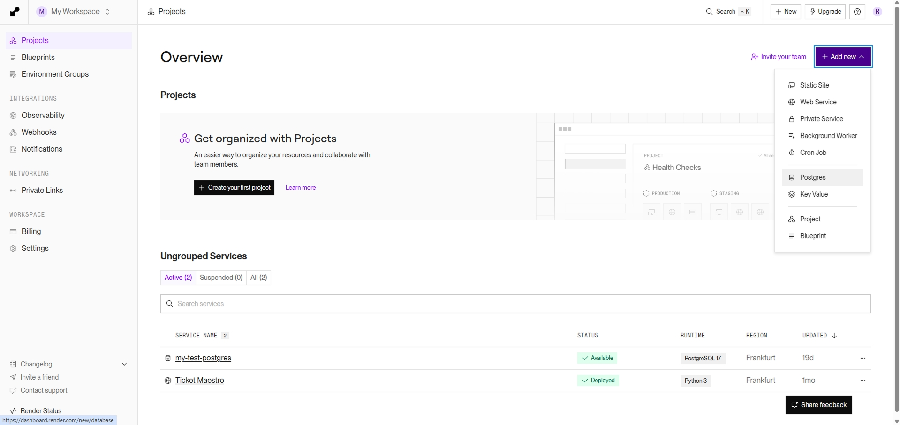
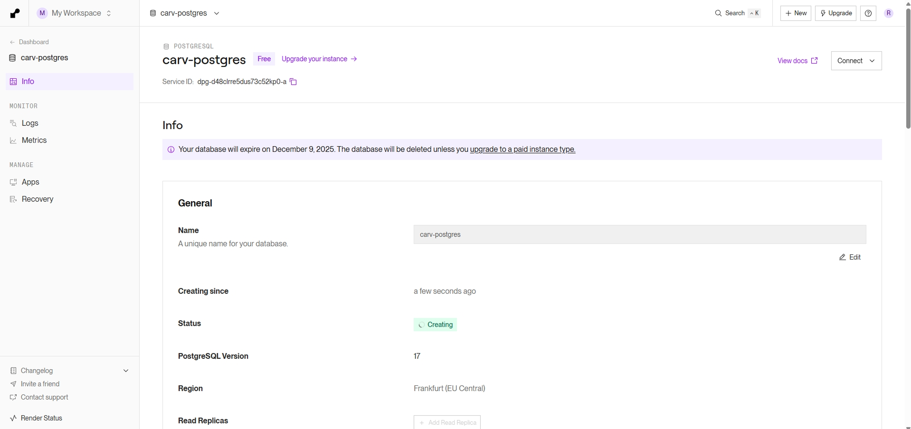
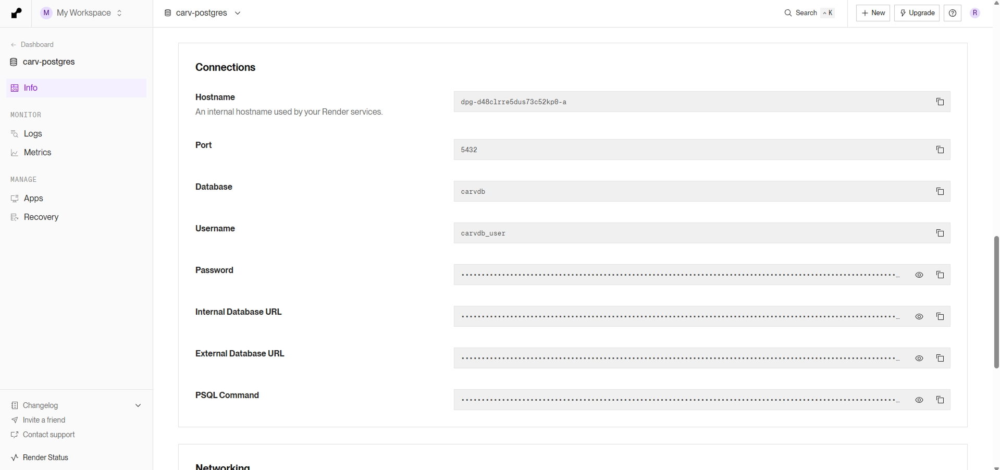
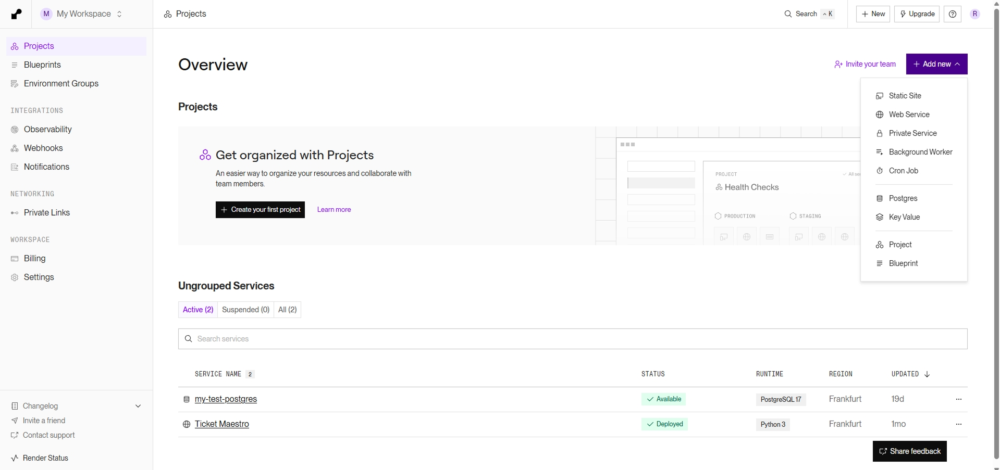
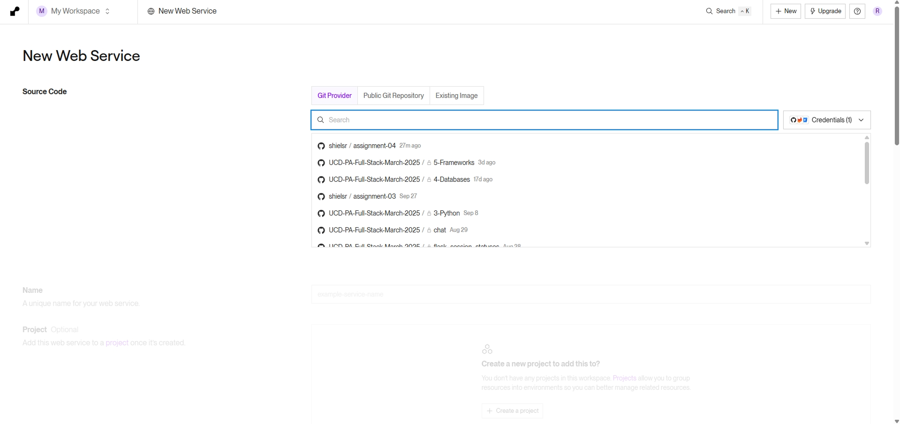
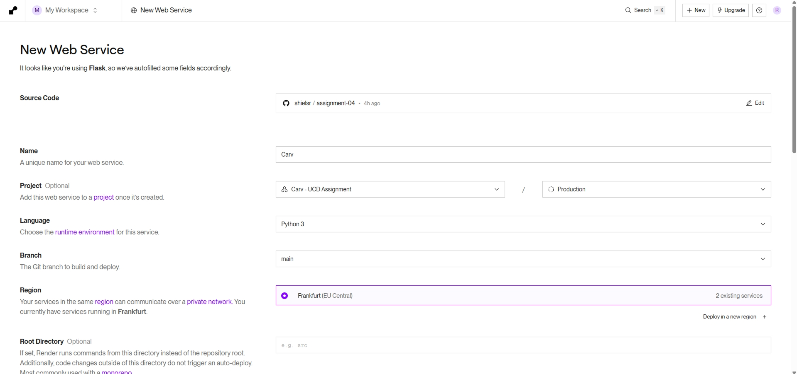
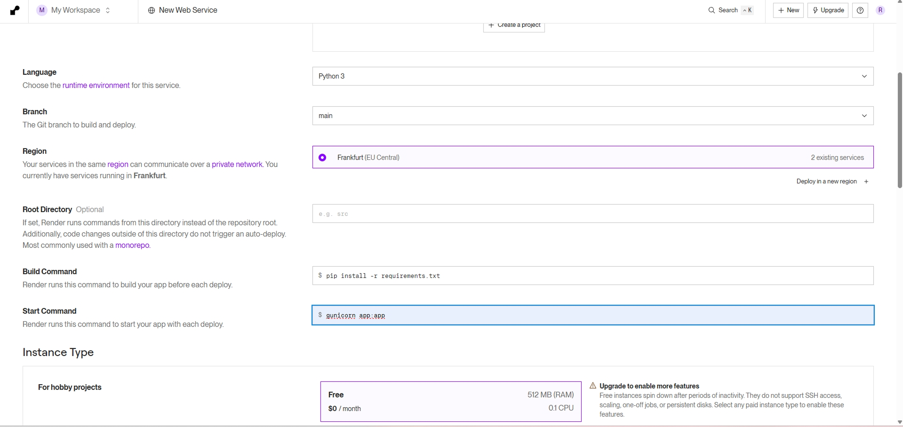
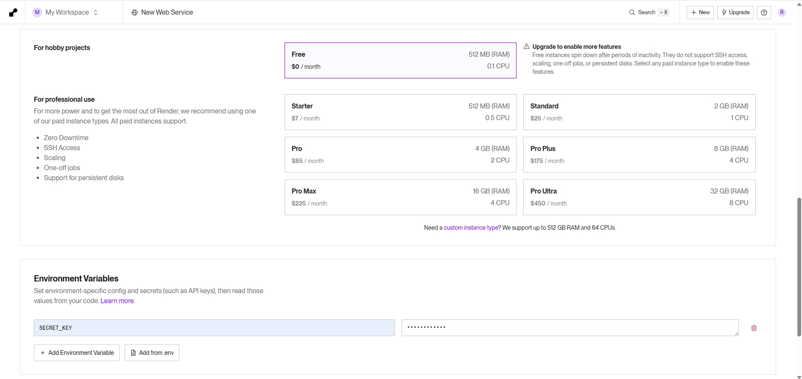
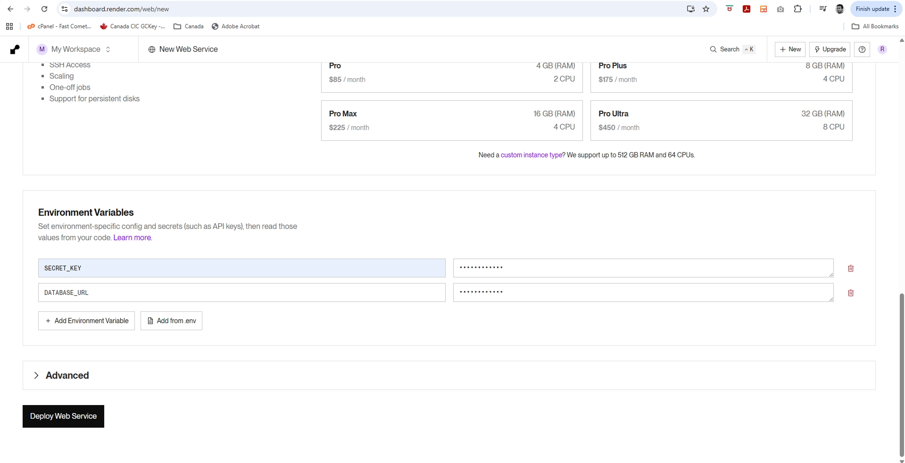

# Instructions on how to deploy the site

## Part 1: Switching from SQLite to Postgres

If switching from SQLite (while hosting locally) to Postgres on Render.com, you need to toggle these lines of code in config.py. That is, comment out whichever you don't need. 

SQLite:
`SQLALCHEMY_DATABASE_URI = os.getenv('DATABASE_URL', 'sqlite:///db.sqlite3')`

Postgres:
`SQLALCHEMY_DATABASE_URI = os.getenv('DATABASE_URL')`

 

## Part 2: New Postgres on Render.com

Create a new Postgres on Render.com

Name the postgres carv-postgres, and name the database carvdb

Choose the Free plan and press Create Database

Copy the Internal Database URL to your clipboard (you'll need it shortly)

 

## Part 3: New Web Service on Render.com

Create a new Web Service on Render.com

Select the Git repository where you committed your files.

Give your web service a name

Make sure your Build Command is `$ pip install -r requirements.txt`
and that the Start Command is `$ gunicorn app:app`

Choose the Free plan.  Then, generate a `SECRET_KEY`.

Add a new environment variable called `DATABASE_URL`. In the input field, paste in the Internal Database URL from the Postgres.

 

## Part 3: Seed the database with default data

Go to the following URL to generate and seed the database with default data: your-render-url/seed  (For example, the URL on my currently hosted version is https://carv-csln.onrender.com/seed )

 
